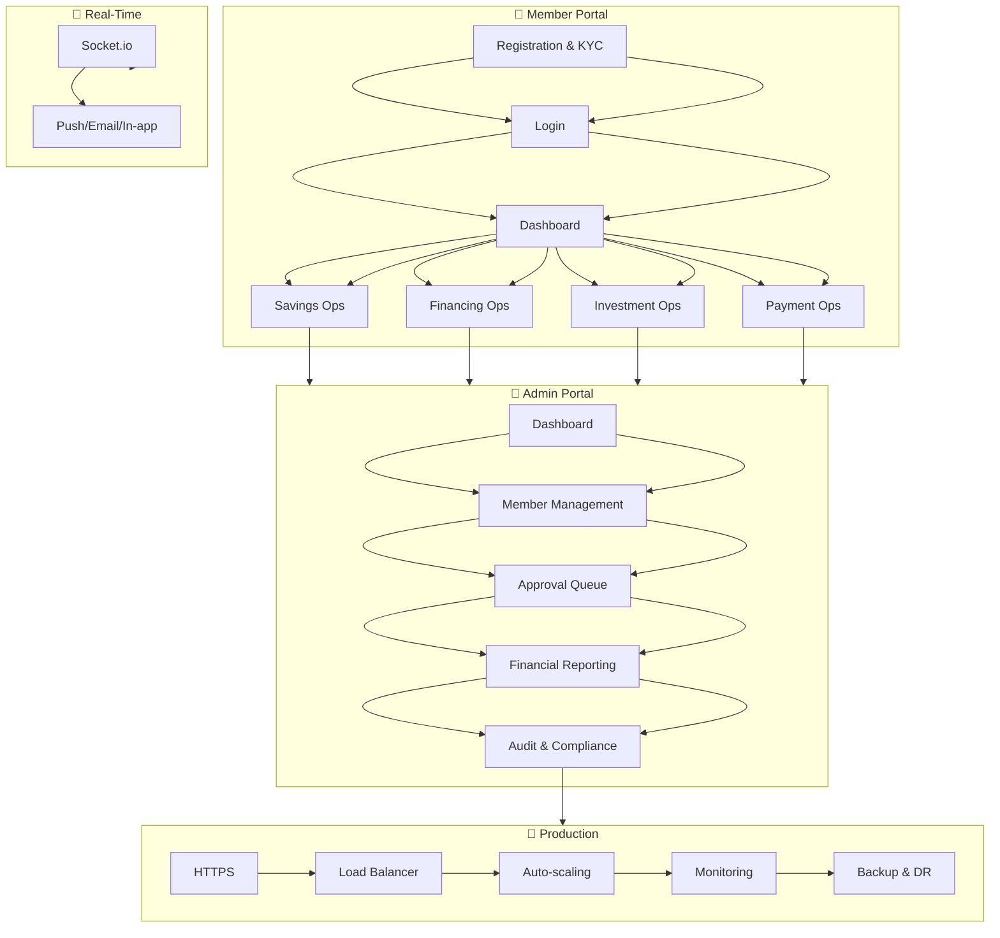

```mermaid
flowchart TD
    subgraph Member["👤 Member Portal"]
        Reg[Registration & KYC] --> Login[Login]
        Login --> Dashboard[Dashboard]
        Dashboard --> Savings[Savings Ops]
        Dashboard --> Financing[Financing Ops]
        Dashboard --> Investment[Investment Ops]
        Dashboard --> Payment[Payment Ops]
    end

    subgraph Admin["🔧 Admin Portal"]
        AdminDashboard[Dashboard] --> MemberMgmt[Member Management]
        MemberMgmt --> ApprovalQueue[Approval Queue]
        ApprovalQueue --> FinancialReporting[Financial Reporting]
        FinancialReporting --> AuditLog[Audit & Compliance]
    end

    subgraph RealTime["📡 Real-Time"]
        Socket[Socket.io] --> Notifications[Push/Email/In-app]
    end

    subgraph Production["🚀 Production"]
        HTTPS[HTTPS] --> LB[Load Balancer]
        LB --> AutoScale[Auto-scaling]
        AutoScale --> Monitoring[Monitoring]
        Monitoring --> Backup[Backup & DR]
    end

    %% Connections
    Reg --> Login
    Login --> Dashboard
    Dashboard --> Savings
    Dashboard --> Financing
    Dashboard --> Investment
    Dashboard --> Payment

    Savings --> Admin
    Financing --> Admin
    Investment --> Admin
    Payment --> Admin

    AdminDashboard --> MemberMgmt
    MemberMgmt --> ApprovalQueue
    ApprovalQueue --> FinancialReporting
    FinancialReporting --> AuditLog

    Socket --> RealTime
    AuditLog --> Production

    classDef member fill:#e1f5fe,stroke:#0288d1;
    classDef admin fill:#f3e5f5,stroke:#7b1fa2;
    classDef realtime fill:#fff3e0,stroke:#f57c00;
    classDef production fill:#e0f2f1,stroke:#009688;
    class Member,Admin,RealTime,Production member,admin,realtime,production;
```