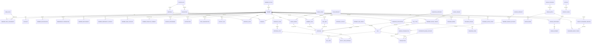

# Entity Relationship Diagram — KKPUS Platform

> Sumber kebenaran: `project-docs/05_ERD.md` (skema lengkap). Diagram ini adalah overview visual.

```mermaid
erDiagram
    %% Core & Auth
    MEMBER_STATUS ||--o{ MEMBER : classifies
    USER_ROLE ||--o{ MEMBER_ROLE_ASSIGNMENT : assigned_as
    MEMBER ||--o{ MEMBER_ROLE_ASSIGNMENT : has
    MEMBER ||--o{ ACCOUNT : owns
    MEMBER ||--o{ MEMBER_REGISTRATION : submits
    MEMBER ||--o{ MEMBERSHIP_TERMINATION : requests
    MEMBER ||--o{ MEMBER_EMPLOYMENT : has
    MEMBER ||--o{ MEMBER_EMERGENCY_CONTACT : has
    MEMBER ||--o{ MEMBER_BANK_ACCOUNT : has
    MEMBER ||--o| MEMBER_FINANCIAL_SUMMARY : summarized_by
    MEMBER ||--o{ SAVINGS_WITHDRAWAL : requests
    MEMBER ||--o{ NOTIFICATION : receives
    MEMBER ||--o{ PUSH_SUBSCRIPTION : subscribes
    MEMBER ||--o{ ACTIVITY_LOG : triggers
    MEMBER ||--o{ MATERIAL_NOTE : writes
    MEMBER ||--o{ RANKING : earns

    %% Approvals
    APPROVAL_FLOW ||--o{ APPROVAL_STEP : contains
    APPROVAL_STATUS ||--o{ APPROVAL : classifies
    APPROVAL ||--o{ ENTITY_STEP_APPROVAL : records
    APPROVAL_STEP ||--o{ ENTITY_STEP_APPROVAL : has

    %% Billing & Payments
    BILL_TYPE ||--o{ BILL : categorizes
    BILL ||--o{ BILL_ITEM : line_items
    BILL ||--o{ TRANSACTION : paid_by
    COOPERATIVE_BANK_ACCOUNT ||--o{ TRANSACTION : receives
    PAYMENT_FEE_CONFIG ||--o{ BILL : fee_applies

    %% Savings
    SAVINGS_PRODUCT ||--o{ MEMBER_SAVINGS_ACCOUNT : product_of
    MEMBER_SAVINGS_ACCOUNT ||--o{ SAVINGS_TRANSACTION : transacts
    SAVINGS_TRANSACTION ||--o| TRANSACTION : linked_to

    %% Tabungan Bertarget
    SAVING_TARGET ||--o{ MEMBER_SAVING_TARGET : target_of
    MEMBER ||--o{ MEMBER_SAVING_TARGET : participates
    MEMBER_SAVING_TARGET ||--o{ SAVINGS_TRANSACTION : transacts

    %% Financing
    FINANCING_CATEGORY ||--o{ FINANCING_APPLICATION : categorizes
    MEMBER ||--o{ FINANCING_APPLICATION : applies
    FINANCING_APPLICATION ||--o{ FINANCING_TERM : terms
    FINANCING_APPLICATION ||--o| APPROVAL : has_approval

    %% Jual Beli
    MEMBER ||--o{ JUAL_BELI : transacts
    JUAL_BELI ||--o| APPROVAL : has_approval

    %% Pinjaman
    LOAN_PRODUCT ||--o{ MEMBER_LOAN : product_of
    MEMBER ||--o{ MEMBER_LOAN : borrows
    MEMBER_LOAN ||--o| APPROVAL : has_approval
    MEMBER ||--o{ PINJAMAN_MODAL : manages
    MEMBER ||--o{ PINJAMAN_HUTANG : owes
    MEMBER ||--o{ PINJAMAN_AKTIVA_TETAP : owns

    %% Arisan
    ARISAN_PROGRAM ||--o{ ARISAN_BATCH : has_batches
    ARISAN_BATCH ||--o{ ARISAN_PARTICIPANT : includes
    MEMBER ||--o{ ARISAN_PARTICIPANT : joins
    ARISAN_PARTICIPANT ||--o{ ARISAN_PAYMENT : pays
    ARISAN_BATCH ||--o{ ARISAN_DRAW : draws

    %% Sukuk
    SUKUK_ISSUE ||--o{ SUKUK_ORDER : issue_of
    MEMBER ||--o{ SUKUK_ORDER : invests
    SUKUK_ORDER ||--o| APPROVAL : has_approval

    %% Training
    CURRICULUM ||--o{ MATERIAL : contains
    CURRICULUM ||--o{ EVALUATION : evaluates
    MATERIAL ||--o{ MATERIAL_NOTE : annotated_by
    EVALUATION ||--o{ RANKING : produces

    %% Content
    ARTICLE ||--o{ CONTACT_FORM : generates

    %% System
    FORGOT_PASSWORD_SESSION ||--o| PASSWORD_RESET_TOKEN : generates
    MEMBER ||--o{ FORGOT_PASSWORD_SESSION : requests
    MEMBER ||--o{ PASSWORD_RESET_TOKEN : owns
```